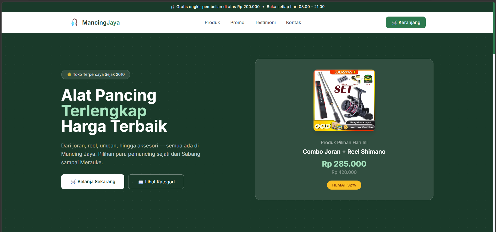
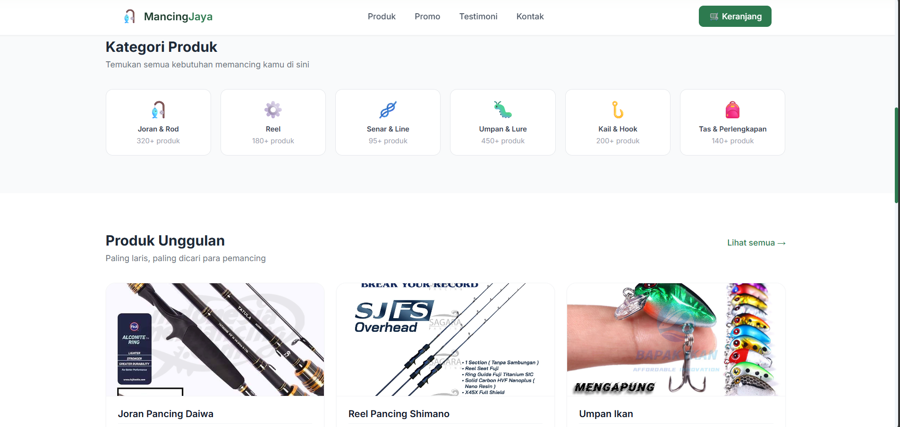
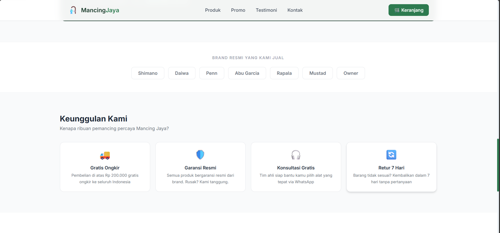
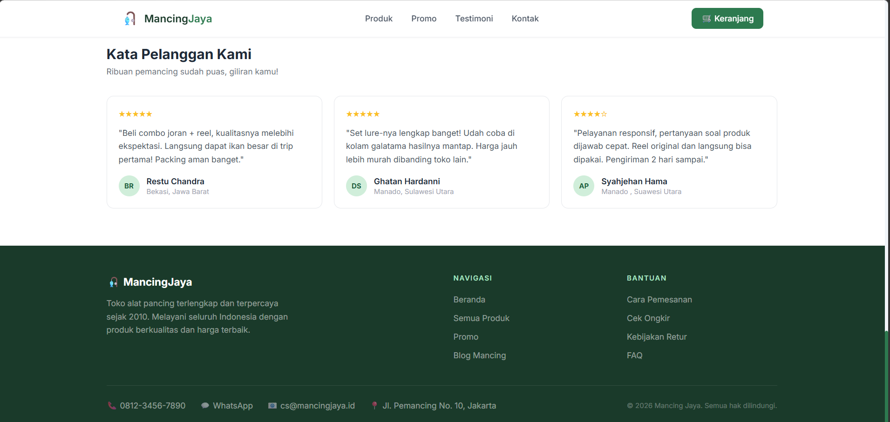

# 🎣 Mancing Jaya — Toko Alat Pancing Online

Website toko alat pancing modern dibangun dengan **React + Vite + Tailwind CSS**.

## 📸 Tampilan Website
<table>
  <tr>
    <td align="center">
      
    <td align="center">
      
  </tr>
  <tr>
    <td align="center">
      
    <td align="center">
      
    </td>
  </tr>
</table>

## 🚀 Cara Menjalankan

```bash
npm install
npm run dev        # http://localhost:5173
```
## 📁 Struktur Project

```
src/
├── components/
│   ├── Navbar.jsx
│   ├── Hero.jsx
│   ├── Categories.jsx
│   ├── ProductCard.jsx
│   ├── Products.jsx
│   ├── Promo.jsx
│   ├── Brands.jsx
│   ├── Services.jsx
│   ├── Testimonials.jsx
│   ├── Footer.jsx
│   └── Toast.jsx
├── data.js          ← semua data produk & konten
├── App.jsx
├── main.jsx
└── index.css
```

## ✨ Fitur

- Navbar sticky + mobile responsive
- Hero section dengan statistik
- 6 Kategori produk
- 6 Kartu produk (gambar + harga + add to cart)
- Banner promo dengan salin kode otomatis
- Brand resmi display
- 4 Keunggulan layanan
- 3 Testimoni pelanggan
- Footer dengan info kontak
- Toast notification interaktif
- Keranjang counter di navbar
